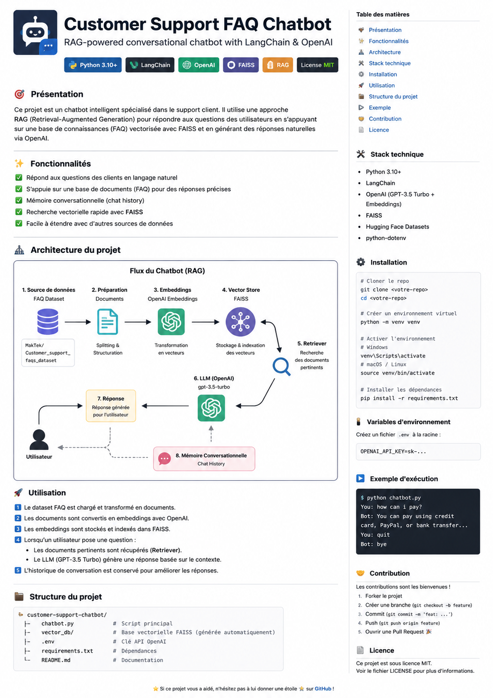

# 🤖 Customer Support FAQ Chatbot (RAG)

> A Retrieval-Augmented Generation (RAG) chatbot built with **LangChain**, **OpenAI**, **FAISS**, and **Hugging Face Datasets**.

<p align="center">
  
</p>

## 📖 Overview

This project demonstrates how to build a conversational Customer Support assistant using a Retrieval-Augmented Generation (RAG) pipeline.

Instead of relying only on an LLM's internal knowledge, the chatbot retrieves the most relevant FAQ documents from a vector database before generating an answer.

## ✨ Features

- FAQ dataset ingestion
- Document preparation with LangChain
- OpenAI embeddings
- FAISS vector database
- Semantic search (Retriever)
- Conversational memory
- GPT-3.5 Turbo response generation

## 🏗️ Architecture

```text
Dataset
   │
   ▼
Load Dataset
   │
   ▼
LangChain Documents
   │
   ▼
OpenAI Embeddings
   │
   ▼
FAISS Vector Store
   │
   ▼
Retriever (Top-K)
   │
   ▼
GPT-3.5 Turbo
   │
   ▼
Final Answer
```

The included image (`customer_RAG.png`) summarizes the complete pipeline.

## 📂 Project Structure

```text
RAG_customer_support/
│── customer_RAG.png
│── chatbot.py
│── vector_db/
│── .env
│── requirements.txt
└── README.md
```

## ⚙️ Technologies

- Python
- LangChain
- OpenAI API
- FAISS
- Hugging Face Datasets
- python-dotenv

## 🚀 Installation

```bash
git clone <repository-url>
cd RAG_customer_support

python -m venv .venv

# Windows
.venv\Scripts\activate

pip install -r requirements.txt
```

Create a `.env` file:

```text
OPENAI_API_KEY=your_api_key
```

## ▶️ Usage

```bash
python chatbot.py
```

Example:

```text
You: how can i pay?
Bot: You can pay using...
```

## 🔍 Pipeline Details

1. Load the FAQ dataset.
2. Convert each FAQ into a LangChain `Document`.
3. Generate embeddings using OpenAI.
4. Store vectors inside FAISS.
5. Retrieve the most relevant documents.
6. Send retrieved context + user question to GPT-3.5 Turbo.
7. Return a grounded response.
8. Maintain conversation history.

## 🚧 Future Improvements

- Streamlit interface
- FastAPI backend
- Docker support
- ChromaDB / Pinecone
- Hybrid search
- Reranking
- Source citations
- GPT-4.1 / GPT-5 support

## 📄 License

MIT License.

## 👤 Author

Amine AIT ALI

If you found this repository useful, consider giving it a ⭐.
