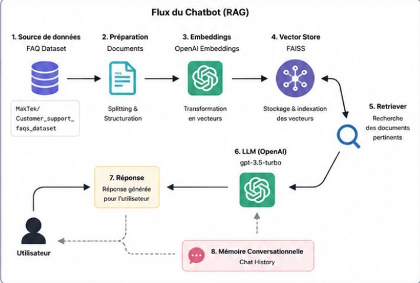

# 🤖 Customer Support FAQ Chatbot (RAG)

<p align="center">


</p>

> A Retrieval-Augmented Generation (RAG) chatbot built with **LangChain**, **OpenAI**, **FAISS**, and **Hugging Face Datasets** to answer customer support questions using semantic search.

---

# 📖 Overview

This project demonstrates how to build a conversational AI assistant powered by the Retrieval-Augmented Generation (RAG) architecture.

Instead of relying only on the knowledge stored inside the language model, the chatbot first retrieves the most relevant FAQ documents from a vector database before generating a final response.

This significantly improves answer accuracy while reducing hallucinations.

---

# 🏗️ Architecture

<p align="center">

</p>

The architecture above illustrates the complete RAG pipeline implemented in this project.

---

# ✨ Features

- Load FAQ dataset from Hugging Face
- Convert data into LangChain Documents
- Generate semantic embeddings using OpenAI
- Store embeddings in FAISS
- Perform semantic similarity search
- Retrieve the Top-K relevant documents
- Generate contextual responses using GPT-3.5 Turbo
- Maintain conversation history

---

# 📂 Project Structure

```text
RAG_customer_support/
│
├── customer_RAG.png
├── cust_supp.py
├── vector_db/
├── .env
├── requirements.txt
└── README.md
```

<p align="center">

</p>

---

# ⚙️ Technologies

- Python
- LangChain
- OpenAI API
- FAISS
- Hugging Face Datasets
- python-dotenv

---

# 📊 Pipeline

```text
HuggingFace Dataset
        │
        ▼
Document Preparation
        │
        ▼
OpenAI Embeddings
        │
        ▼
FAISS Vector Database
        │
        ▼
Retriever (Top-K)
        │
        ▼
GPT-3.5 Turbo
        │
        ▼
Answer Generation
```

---

# 🚀 Installation

Clone the repository

```bash
git clone https://github.com/your_username/RAG_customer_support.git
cd RAG_customer_support
```

Create a virtual environment

```bash
python -m venv venv
```

Activate it

### Windows

```bash
venv\Scripts\activate
```

### Linux / macOS

```bash
source venv/bin/activate
```

Install dependencies

```bash
pip install -r requirements.txt
```

---

# 🔑 Environment Variables

Create a `.env` file in the project root.

```env
OPENAI_API_KEY=your_openai_api_key
```

---

# ▶️ Run the Project

```bash
python cust_supp.py
```

---

# 💬 Example

```text
You : How can I pay?

Bot :
You can pay using Visa, Mastercard, PayPal,
or any other supported payment method.
```

---

# 🧠 How it Works

1. Load the FAQ dataset.
2. Convert each FAQ into a LangChain `Document`.
3. Generate embeddings using OpenAI.
4. Store embeddings in FAISS.
5. Retrieve the Top-K most relevant documents.
6. Build the prompt with retrieved context.
7. GPT-3.5 Turbo generates the answer.
8. Store the conversation history for contextual interactions.

---

# 🚧 Future Improvements

- Streamlit Web Interface
- FastAPI REST API
- Docker Support
- ChromaDB Integration
- Pinecone Integration
- Hybrid Search
- Re-ranking Models
- Source Citation
- GPT-4.1 / GPT-5 Support
- Multi-user Sessions

---

# 📄 License

This project is released under the MIT License.

---

# 👨‍💻 Author

**Amine AIT ALI**

If you found this repository useful, please consider giving it a ⭐ on GitHub.